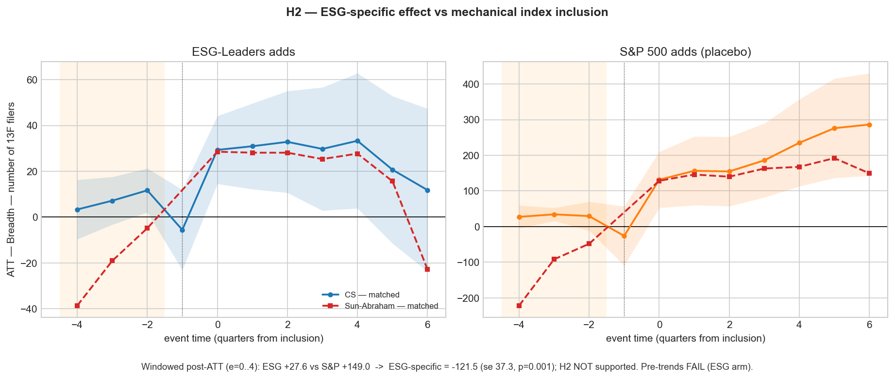

# ESG Label or Just the Index? Causal Evidence on Institutional Flows

**Research question.** When a stock enters the MSCI USA (Extended) ESG Leaders
index, does institutional capital *causally* flow in — and is that an
**ESG-specific** response, or merely the mechanical index-inclusion demand shock
that *any* index add produces? And is that response **eroding** as ESG loses
political legitimacy?

**Headline finding (a scope-limited, honest null).** *In plain terms:* when a stock
joins this ESG index, the **number of institutional investors** that pile in is **no
larger than** when a stock joins an ordinary index like the S&P 500 — so the **ESG
label itself draws no extra investors** (if anything, slightly fewer). What looks
like an "ESG attracts investment" effect is really just the generic "a stock got
added to an index" effect. *(This is a claim about the* number *of investors —
"breadth"; whether ESG changes how many* shares *each one holds, or whether the pull
is fading post-2022, this sample can't resolve — see below.)*

*Precisely — and note the claim rests on **power, not on the negative number**:* the
defensible result is **scope-limited to ownership breadth** (count of 13F filers).
The breadth design is **well-powered** — it could detect a true ESG premium as small
as ≈ **104** filers — yet the 95% CI **rules out even a positive premium a quarter
the size of a generic index add**. The raw point difference (ESG minus generic ≈
**−121 filers, p = 0.001**) is *more* negative than that, but we **don't lean on
it**: it is itself fragile to the pre-trend problem (honest-DiD breakdown M\* ≈ 0.26)
and the ESG arm fails the parallel-trends test. **Depth and the post-2022 "legitimacy
decay" are inconclusive (underpowered), not null** — reported as open questions, not
as evidence of absence. The full writeup is in [`paper/paper.md`](paper/paper.md).



*Breadth (number of 13F filers) around index inclusion; event time in quarters,
shaded band = pre-period parallel-trends test. **Left:** ESG-Leaders adds draw
≈ +28 filers. **Right:** matched generic S&P 500 adds draw ≈ +149. Differencing
the two isolates the ESG-specific effect: **−121.5 filers (se 37.3, p = 0.001)**
— ESG inclusion draws **less** institutional breadth than an ordinary index add,
not more. (We rest the conclusion on the equivalence/power bound, not on this
negative point estimate, which is pre-trend-fragile — see Credibility.)*

<details>
<summary><b>Plain-language primer — what the terms mean</b> (click to expand)</summary>

- **13F filers / "breadth."** Big institutional investors — mutual funds, pension
  funds, hedge funds managing over \$100M — must report their U.S. stock holdings to
  the SEC every quarter on a *Form 13F*. **Breadth** = how many distinct filers hold
  a stock (how many institutions own it). **Depth** = the total shares they hold.
  These are the outcomes we track around index inclusion.
- **The placebo (the key trick).** When *any* stock joins a major index, funds that
  track that index are mechanically forced to buy it — a demand bump that has nothing
  to do with ESG. To isolate the part of the inflow that is *specifically* about the
  ESG label, we run the identical analysis on stocks added to the ordinary **S&P 500**
  (a non-ESG index) and subtract. What's left is the ESG-specific effect.
- **Parallel-trends (pre-trends) test.** The method assumes treated and comparison
  stocks were moving *in parallel* before inclusion. We test that on the pre-join
  quarters; if they were already diverging, the estimate isn't trustworthy — and we
  flag it when that happens (it does, for the ESG arm).
- **"An honest null."** We pre-registered the hypotheses *before* estimation, so the
  result can't be fished for. We find no ESG-specific premium — and crucially this is
  a **well-powered** null: the design was sensitive enough to catch a premium a
  quarter the size of the mechanical effect, so "we found nothing" means "there is
  probably nothing there," not "our test was too weak to tell."

</details>

### Results at a glance

*How to read this: each row is one pre-registered hypothesis; a "filer" is one
institutional investor; positive numbers = more investors flowing in. The headline
test is **H2** — the ESG-*specific* premium — a **well-powered null**: the design
could have caught a real premium, but the 95% CI rules one out.*

| Hypothesis | Prediction | Headline estimate (breadth, 13F filers) | Verdict |
|:--|:--|:--|:--|
| **H1** — index inclusion moves flows | positive | ESG **+27.6** (se 9.4); S&P placebo **+149.0** (se 36.1) | Mechanical effect present; ESG pre-trend fails |
| **H2** — ESG-*specific* premium | ESG > generic | ESG − generic = **−121.5** (se 37.3), **p = 0.001** | **Not supported — well-powered null** (CI excludes a positive premium) |
| **H3** — legitimacy decay post-2022 | late < early | early +33.5, late +21.4; Δ = **−12.1** (se 18.1), p = 0.50 | **Inconclusive — underpowered** (MDE ≈ 51 ≫ \|Δ\|=12); right sign |
| **H4** — heterogeneity by filer type | concentrated in ESG/passive | re-ingested 13F at CIK grain; ESG-specific < 0 in **0 / 4** filer-type outcomes (best channel `log_shares_esg` **−1.13**, p = 0.026) | **Not supported — null survives decomposition** |
| **Robustness** — 8 pre-registered specs | — | ESG-specific < 0 in **8 / 8**; significant in **7 / 7** that carry inference (−61 to −137 filers) | Null is robust |
| **Credibility** — power / MDE / honest DiD / placebo | — | breadth null is **well-powered** — the design could have caught a premium of ≈ **104** filers (the 80%-power floor), and the 95% CI rules out *any* positive premium; depth & decay tests **underpowered** (said so plainly); the negative estimate is itself **fragile to the pre-trend problem** (honest DiD M\* ≈ 0.26); the +28-filer level effect is **not a timing fluke** (placebo-in-time p = 0.013) | Breadth null is *evidence of absence*; rests on power, not the negative sign |

*Estimator: heterogeneity-robust Sun-Abraham event study on CEM-matched controls,
windowed post-ATT over event quarters 0–4 — in plain terms, we line up each stock by
quarters-since-it-joined, compare ESG joiners against non-ESG joiners matched on size
and prior ownership, and average the investor-count gap over the four quarters after
joining. Depth (`log_shares`) is **inconclusive, not null** — negative in every spec
and significant in none, but underpowered (MDE ≈ 1.26 log-pts; the equivalence test
does not clear), so no depth conclusion is drawn. Full numbers in
[`results/`](results/) and [`paper/paper.md`](paper/paper.md).*

**Status:** Phase 6 complete (data → panel → matched controls + placebo →
estimation → pre-registered robustness battery → filer-type heterogeneity →
credibility-of-the-null battery → writeup). All sources ingested (Fama-French,
S&P 500 changes, prices; SEC N-PORT
treatment + 13F outcome); panel, matched samples, and placebo arm built; the
heterogeneity-robust staggered-DiD battery estimated, stress-tested across 8
specifications, decomposed by 13F filer type (H4, re-ingested at CIK grain), and
put through a pre-specified credibility-of-the-null battery (power/MDE +
equivalence + honest DiD [Rambachan-Roth] + placebo-in-time randomization)
(`results/`),
figures/tables rendered (`paper/`), and the paper drafted. SEC access resolved —
see [SEC access note](#sec-access). Hypotheses frozen in `PREREGISTRATION.md`
before estimation; per-input provenance in `data/DATA_LINEAGE.md`.

---

## Why this is rigorous, not just another ESG regression

1. **Placebo identification.** Any index addition moves flows mechanically
   (Shleifer 1986; Harris-Gurel 1986; Wurgler-Zhuravskaya). Running the *same*
   estimator on matched non-ESG inclusions (S&P 500 adds) isolates the
   ESG-specific component:
   `ESG-specific effect = ESG-inclusion effect − generic-inclusion effect`.
2. **ESG-legitimacy decay (the original contribution).** Test whether the
   institutional-flow response to ESG inclusion *weakens after ~2022*, as ESG
   becomes politically contested. *(Candid status: on this sample the decay test is
   **underpowered** — H3 p = 0.50, MDE ≈ 51 filers ≫ |Δ| = 12 — so we could **not
   detect** decay. That is a failure to detect, not evidence it is absent; powering
   it up is the natural v2 — see [Roadmap](#roadmap-v2).)*
3. **Heterogeneity.** Split responders: passive vs active 13F filers; ESG-badged
   funds vs not — the effect should concentrate where theory predicts.
   *(Estimated by re-ingesting the raw 13F at the filer-CIK grain and re-running
   the placebo contrast per filer type. The null survives: no channel — including
   passive-complex depth — shows a positive ESG-specific effect; ESG-named
   managers' depth response is significantly weaker for ESG than generic adds.
   13F is filed at the manager level, so ESG-named = ESG-branded firms, not ESG
   sleeves of large complexes, which surface as passive depth — see paper §5.4.)*
4. **Normative framing.** EU SFDR, UK SDR and the SEC climate-disclosure regime
   treat ESG ratings as quasi-authoritative signals that *lead* capital. If the
   ESG-specific effect is weak, absent, or decaying, that architecture rests on a
   false premise — a business-ethics finding, not just a finance result.

## Design at a glance
- **Treatment:** firm enters ESG Leaders (proxied via iShares SUSL/SUSA N-PORT
  quarterly-holdings diffs; identifier-churn adds flagged). **Quarterly** event
  time (13F is quarterly).
- **Primary outcomes:** ownership **breadth** (`n_filers`, count of 13F filers) and
  **depth** (`log_shares`, log aggregate shares — unit-immune to the 2023 13F
  value-reporting change). **Secondary:** `log_value` and an FF-adjusted cumulative
  abnormal return (the latter on the S&P 500 placebo arm only — see guardrails).
- **Estimators:** event study + heterogeneity-robust staggered DiD
  (Callaway-Sant'Anna, Sun-Abraham). *Not* naive two-way FE (Goodman-Bacon).
- **Identification checks:** mandatory pre-trends test; S&P 500 placebo; post-2022
  structural break. Hypotheses pre-registered in `PREREGISTRATION.md` (frozen
  before estimation).

## Data
See `data/DATA_LINEAGE.md` for source, URL, date, license, and status of every
input. Reachable & ingested: Fama-French factors, S&P 500 change events, prices.
SEC-hosted: N-PORT holdings (treatment) ✅ and 13F holdings (outcome) ✅ both
pulled. All raw/interim/processed data is gitignored and rebuilds from source.

## Repository
```
src/ingest/    ff_factors, sp500_events, prices  (reachable);
               edgar_13f, nport_holdings, edgar_session  (SEC, run unblocked);
               edgar_13f_byfiler  (Phase 5 filer-CIK re-ingest, no network)
src/build/     panel, matching, crosswalk, car, placebo   (Phase 2-2b)
src/estimate/  did (CS + Sun-Abraham), robustness, event_study, heterogeneity,
               h4_filer, placebo, structural_break        (Phase 3-5)
               credibility  (Phase 6 — power/MDE + honest DiD + placebo-in-time)
src/viz/       figures
tests/         smoke (reachable data) + SEC-transform + estimator/robustness units
data/          raw/ interim/ processed/ (gitignored) + DATA_LINEAGE.md
results/        *.csv / *.parquet estimates (committed) + run logs (gitignored)
paper/         writeup + figures/ tables/
```

## Reproduce
```bash
python -m venv venv && source venv/bin/activate
pip install -r requirements.txt        # ingestion stack; see note on the econ stack
make data            # Fama-French, S&P 500, prices  (works anywhere)
make test            # 56 tests: reachable-data smoke + SEC-transform + estimator/credibility units
# --- the following require an unblocked network (see SEC access note) ---
echo "SEC_EDGAR_UA=Your Name you@email.com" > .env
make data-sec        # 13F + N-PORT
make panel matched estimate robustness
make heterogeneity   # Phase 5 — H4 filer-type re-ingest + ESG/passive contrast
make credibility     # Phase 6 — power/MDE + equivalence + honest DiD + placebo-in-time
make figures         # render all exhibits (incl. H4 + credibility panels)
```
> **Econometrics stack note.** `pyfixest`/`differences`/`polars`/`numba` are
> pinned in `requirements.txt` and run in this venv — estimation and the full
> test suite pass locally. If a fresh `pip install` can't build the wheels for
> your numpy/pandas, fall back to
> `conda install -c conda-forge pyfixest polars numba differences`. None are
> needed for ingestion (Phase 1) — only for estimation (Phase 3+).

## <a name="sec-access"></a>SEC access note (resolved)
SEC's Akamai bot-manager 403'd every client until **two stacked filters** were
cleared: (1) a **datacenter/VPN egress IP** (SEC blocks those wholesale — run
from a residential ISP with the VPN off), and (2) a **non-deliverable UA email**
(e.g. a `…@users.noreply.github.com` address — set
`SEC_EDGAR_UA="Name real@email.com"` in `.env`). Both fixed → 200.
`src/ingest/edgar_session.py` raises a clear `EdgarBlocked`, now with a live
egress-IP diagnosis, if either condition recurs.

## Honest guardrails
Institutional (13F) flows, **not retail** (the original retail framing is dropped
— no WRDS/Vanda access; don't overclaim retail behaviour). Quarterly → coarse
event timing. Index membership reconstructed via an ETF/N-PORT proxy, and
treatment is a CUSIP diff — so corporate-action CUSIP changes (splits,
redomiciles, renames, mergers) can masquerade as inclusions; exact-name cases are
auto-flagged (`corp_action_suspect`) and the changed-name remainder is reconciled
in Phase 2. **The data is the soft underbelly, stated plainly:** treatment is an
ETF-holdings *proxy* for index membership (not the MSCI list), and the S&P 500
placebo arm is only **65 events** — that small *n* is the precision bottleneck for
the entire ESG-specific subtraction (the se of 37.3 on the −121 estimate flows
straight from it). The well-powered claim is **breadth only**; depth and decay are
underpowered and left open. Causal claims rest on the parallel-trends/placebo design
holding; reported when it doesn't.

## <a name="roadmap-v2"></a>Roadmap (v2)
The breadth null is already well-powered and won't move. The genuinely open question
is **legitimacy decay (H3)**, which this sample is too thin to resolve (H3 p = 0.50;
MDE ≈ 51 filers ≫ |Δ| = 12). A scoping pass against the realised data shows the two
open dimensions need **different** fixes — and that the obvious "just add more ETFs /
a longer panel" move barely helps the one that matters:

- **H2's precision** is set by the **65-event clean placebo arm** (58 of the 123
  in-sample S&P 500 adds are *also* ESG names, dropped to keep the placebo non-ESG).
  Extending the panel **backward** is cheap — 13F structured filings exist from 2013
  and S&P 500 change history is free — and would roughly double that arm. But H2 is
  *already* well-powered, so this is low marginal value.
- **H3 is ESG-arm only** — it splits the 334 ESG events at 2022Q1 and differences the
  halves — so a larger placebo arm does **nothing** for it. Its limits are
  *structural*: the ETF-holdings proxy **cannot reach before 2019Q1** (N-PORT public
  data begins April 2019), and MSCI USA ESG Leaders is a single index with a roughly
  fixed constituent count, so additional ESG ETFs add few new names.

The **only** real unlock for H3 is a **non-ETF MSCI ESG Leaders membership *history***
(a clean machine-readable one is licensed — MSCI, Bloomberg, or Refinitiv; MSCI's free
quarterly review notices give only forward point-in-time add/deletes, not a
reconstructable back-history): it extends the ESG arm years before the 2019Q1 N-PORT
floor (the Extended index SUSL tracks launched only in Feb 2019; its parent MSCI USA
ESG Leaders index carries constituent history from the family's 2013 launch) *and*
removes the CUSIP-churn measurement error of inferring membership from an
ETF-holdings diff. That is the single move that converts H3 from *inconclusive*
to *answered* — and it would **not** overturn the well-powered breadth null.

## About
Built by Jimmy Kaian Ji — KCL Philosophy BA. Applying causal-inference
methodology to capital markets and regulatory design.
Related: [HR Attrition Analytics](https://github.com/JimmyKJi/hr-attrition-analytics).
Contact: [linkedin.com/in/jimmy-kaian-ji](https://www.linkedin.com/in/jimmy-kaian-ji/).

---
*Original analysis. Findings will be reported honestly regardless of whether they
support the initial hypothesis.*
