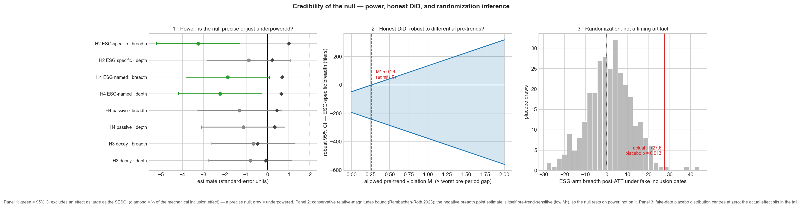

# 1. Introduction

A central premise of the modern sustainable-finance architecture is that ESG
ratings and labels move capital. The EU's Sustainable Finance Disclosure
Regulation (SFDR), the UK's Sustainability Disclosure Requirements (SDR), and the
U.S. SEC's climate-disclosure rule all rest, implicitly, on the idea that an ESG
designation is an *informative signal* that reallocates investment toward
better-rated firms. If that premise is false — if the capital that appears to
follow ESG labels is in fact following ordinary index mechanics, or is not
following the *label* at all — then the normative case for that regulatory
apparatus is weaker than it appears.

This paper asks a narrow, testable version of that question. When a stock is
**added to an ESG index**, does institutional capital causally flow in, and is
that response **ESG-specific** or merely the **mechanical index-inclusion**
effect that *any* index addition produces? The mechanical effect is well
established: index additions move prices and ownership because index-tracking
demand is price-inelastic and arbitrage is limited (Shleifer 1986; Harris and
Gurel 1986; Wurgler and Zhuravskaya 2002; Chang, Hong and Liskovich 2015). The
open question is whether ESG inclusion does anything *beyond* that baseline.

The empirical challenge is that ESG inclusion and ordinary index mechanics are
confounded by construction — ESG indices are themselves indices. The design here
addresses this with a **placebo arm**: I run the *same* staggered-DiD estimator
on generic S&P 500 additions over the same window, and define

$$\text{ESG-specific effect} = \widehat{\text{ATT}}(\text{ESG inclusion}) - \widehat{\text{ATT}}(\text{S\&P 500 inclusion}).$$

If ESG inclusion only reproduces the mechanical effect, this difference is zero;
if the label carries independent allocative weight, it is positive.

Three features make this more than another ESG regression. First, the design is
**pre-registered**: hypotheses, outcomes, sample, estimators, and a pre-trends
decision rule were frozen in `PREREGISTRATION.md` before any treatment effect was
estimated. Second, the estimators are **heterogeneity-robust** — Callaway and
Sant'Anna (2021) and Sun and Abraham (2021), not the two-way fixed-effects
estimator that is biased under staggered adoption with heterogeneous effects
(Goodman-Bacon 2021). Third, the **reporting is honest about identification
failure**: the pre-trends test is treated as load-bearing, and where it fails the
paper says so rather than presenting a contaminated coefficient as causal.

**Findings.** I find no ESG-specific premium in ownership **breadth** — the one
dimension the design is well-powered to test — while the depth and post-2022 decay
tests are **inconclusive (underpowered), not null**. ESG-Leaders
inclusion is associated with an increase in ownership breadth of about +28 13F
filers over the first four post-inclusion quarters, but a generic S&P 500
addition is associated with a far larger increase (~+149 filers); the
ESG-minus-generic contrast is −121 filers (p = 0.001). The ordering — ESG
response ≤ generic response — is robust across all three estimators and both
control pools. On ownership *depth*, the ESG *arm's* own level response is a tight zero (−0.004,
se 0.085), but the ESG-*specific* depth contrast is **inconclusive** — the noisy
S&P 500 placebo depth arm leaves it underpowered (MDE ≈ 1.26 log points; the
equivalence test does not clear), so no depth conclusion is drawn. Crucially, the
ESG arm fails the pre-trends test on every breadth/depth
specification, so the level estimates are reported with that caveat attached, not
as clean causal effects; the single specification whose ESG pre-trends pass (log
dollar value) returns a zero effect. A post-2022 cohort split is signed toward
"legitimacy decay" but is statistically insignificant and underpowered. The
heterogeneity hypothesis is tested by re-ingesting the raw 13F at the filer (CIK)
grain and decomposing the response by filer type (passive vs. active, ESG-badged
vs. not): the null survives — no filer-type channel, including passive-complex
*depth* (the mechanical index-tracking channel), shows a positive ESG-specific
pile-in (0 / 4 outcomes), and ESG-named managers' dollar response is significantly
*weaker* around ESG adds than around generic additions.

The contribution is therefore less a positive effect than a **credible,
transparent null** built on a placebo-identified, pre-registered design — and an
argument that the burden of proof for "ESG labels lead capital" is not met by the
institutional-flow data once the index mechanism is differenced out.

# 2. Institutional setting and hypotheses

**ESG-index inclusion.** The treatment is entry into the MSCI USA (Extended) ESG
Leaders index. Because the index membership list is licensed, I proxy inclusion
through the holdings of two iShares ETFs that track MSCI USA ESG indices — SUSL
(ESG MSCI USA Leaders) and SUSA (MSCI USA ESG Select) — disclosed quarterly to
the SEC on Form N-PORT-P. A CUSIP present in the fund at quarter *t* but absent at
*t−1* is treated as an inclusion event (Section 3). This is an ETF/N-PORT *proxy*
for index membership, not the index itself — a limitation stated plainly
throughout.

**The mechanical benchmark.** S&P 500 additions are the canonical generic
index-inclusion event and the natural placebo: they generate index-tracking
demand with no ESG content. Running the identical estimator on S&P 500 adds
isolates the ESG-specific component of any inclusion response.

**Hypotheses (pre-registered, frozen before estimation).**

- **H1 (inclusion → flows).** ESG-Leaders inclusion raises institutional
  ownership breadth (`n_filers`) and depth (`log_shares`) over event-quarters
  0…+4.
- **H2 (ESG-specific effect — primary).** The inclusion effect for ESG adds
  exceeds the effect for generic S&P 500 adds: `ATT(ESG) − ATT(S&P) > 0`.
- **H3 (legitimacy decay — original contribution).** The response attenuates for
  cohorts included on/after 2022Q1, as ESG investing becomes politically
  contested: `ATT(late) − ATT(early) < 0`.
- **H4 (heterogeneity).** The response concentrates in passive and ESG-badged
  13F filers relative to active / non-badged filers.

The **decision rule**, also pre-registered: H1–H3 are "supported" only if signed
as predicted *and* the pre-trends test passes for the relevant sample. H4 reuses
the H2 contrast machinery per filer type, so an outcome is "supported" only if its
ESG-specific contrast is positive, significant (p < 0.05), and the ESG arm's
pre-trends pass.

# 3. Data

All inputs, with source, URL, license, and pull date, are catalogued in
`data/DATA_LINEAGE.md`. Raw and intermediate files are reproducible from `make
data` / `make data-sec` and are not committed; the small estimation outputs are.

**Treatment — ESG inclusion (SEC Form N-PORT-P).** Quarterly N-PORT holdings of
SUSL and SUSA, 2020–2026, diffed across consecutive snapshots. Of 946 raw
add/drop events (494 adds), 27 are flagged as identifier churn (same-quarter
exact-name add+drop pairs from CUSIP changes), leaving **481 genuine
inclusions**. The cohort for each treated firm is its **first** inclusion
quarter. Treatment is defined as first inclusion and treated as absorbing
(intention-to-treat), even though 177/334 firms later exit the index — so
long-horizon ATTs are attenuated by exits, reported rather than corrected.

**Outcome — institutional holdings (SEC Form 13F).** The SEC's quarterly Form 13F
structured data sets. After parsing each bundle's `INFOTABLE`, taking the modal
period of report, deduplicating to the latest filing per manager (CIK), and
rolling up by CUSIP, the outcome panel has **988,292 CUSIP×quarter rows across 29
quarters (2019Q1–2026Q1)**. Two outcomes are primary: `n_filers` (breadth: the
count of distinct 13F filers holding the CUSIP) and `log_shares` (depth: log
aggregate shares). Shares and filer counts are immune to the 2023 change in 13F
dollar-value reporting units; `log_value` is therefore secondary.

**Analysis panel.** Joining outcome, treatment, and membership flags yields
`panel.parquet`: **904,589 rows, 95,572 CUSIPs, 29 quarters**, with **334
datable ESG inclusions**, **95,035 clean (never-treated) controls**, and 203
firms held out of the control pool (left-censored members and corp-action-suspect
adds). CUSIP coverage of the treatment events is 334/335 (99.7%).

**Placebo arm — S&P 500 additions.** S&P 500 change events from Wikipedia's
constituent-change table, mapped from ticker/name to CUSIP through a crosswalk
built from the 13F issuer-name fields (92% match coverage on post-2019 adds). The
panel carries a symmetric `sp500_*` cohort structure. Of 123 placebo-treated
CUSIPs, **58 are *both* ESG- and S&P-treated** (a contamination flag) and are
excluded, leaving **65 clean-generic** firms (S&P-added, never ESG-treated) as the
primary placebo.

**Matched controls.** The full clean-control pool is dominated by micro-caps; the
treated firms are large index-eligible names, sitting >2 standard deviations above
the pool mean on size (|SMD| ≈ 2.1–2.5). I therefore build per-cohort matched
samples at the baseline quarter g−1 on pre-treatment ownership covariates
(`log_value`, `log_shares`, `n_filers`), using both propensity-score matching
(PSM) and coarsened exact matching (CEM; Iacus, King and Porro 2012), run
symmetrically for both arms. Matching collapses imbalance to |SMD| < 0.05 (CEM).
The CEM-matched pool is the credible comparison; the full pool is the
pre-registered (but confounded) headline, reported for transparency.

**Secondary price outcome.** A Fama–French five-factor cumulative abnormal return
(CAR) around inclusion, computed on the **S&P 500 placebo arm only**: a daily
event study needs a priceable ticker and a precise date, which the ESG arm lacks
(no free CUSIP→ticker bridge; N-PORT dates inclusion only at the fund's fiscal
quarter-end). The CAR recovers the *modern, arbitraged-era* S&P 500 index effect
— CAR[−5,+5] = +1.35% (t = 1.55, n = 99) — consistent with the post-2010s
literature, and serves as a sanity check that the placebo arm behaves as the
index-effect literature predicts.

# 4. Empirical strategy

Because inclusions are staggered across quarters and treatment effects are
plausibly heterogeneous across cohorts and horizons, the two-way fixed-effects
(TWFE) event study is biased: it contaminates clean comparisons with "forbidden"
comparisons that use already-treated units as controls (Goodman-Bacon 2021). I
therefore use two heterogeneity-robust estimators as the headline and retain TWFE
only as a labelled baseline.

**Callaway–Sant'Anna (2021).** Group-time average treatment effects ATT(g,t)
estimated against never-treated (clean) controls via the `differences` package,
then aggregated to a dynamic event-study path. This is the headline dynamics
estimator.

**Sun–Abraham (2021).** An interaction-weighted (IW) event study, implemented
manually as a saturated regression of the outcome on cohort × event-time
indicators (reference event-time −1) with firm and calendar-quarter fixed
effects and firm-clustered standard errors, then aggregated to ATT(e) using
cohort-share weights with a delta-method covariance. The IW aggregation
normalises weights over the cohort × event cells that survive collinearity drops,
so that a dropped post-window cell does not bias the aggregated coefficient toward
zero. This estimator carries the windowed post-ATT and the pre-trends inference,
and is the estimator used for the H2 and H3 contrasts.

**Windowed ATT and pre-trends.** The summary effect is the average ATT over the
pre-registered post-window e ∈ [0, +4]. The **mandatory pre-trends test** is a
joint Wald test that the pre-period coefficients at event-times {−4, −3, −2}
equal zero, distributed χ²(3); parallel pre-trends are *not rejected* (the test
"passes") when p ≥ 0.05. Per the pre-registration, a failed pre-trends test means
the corresponding level estimate is not interpreted as clean causal evidence.

**Control pools.** Every estimator runs on (i) the full clean-control pool — the
pre-registered headline, which the pre-registration itself anticipated would be
confounded because treated firms are large and the pool is micro-caps on a steep
secular ownership uptrend — and (ii) the CEM-matched pool, which balances the
*level* at baseline. Matching the level does not by itself remove a differential
*trend*, so pre-trends can still fail under selection-into-index growth; this is
exactly what the data show.

# 5. Results

## 5.1 H1 — Inclusion and institutional flows

On the credible CEM-matched design, ESG-Leaders inclusion raises ownership
breadth by **+27.6 filers** (Sun–Abraham windowed post-ATT, se 9.4) — but the
joint pre-trends test **fails** (p = 0.001). Ownership *depth* is a precise
**≈ 0** (−0.004 log points, se 0.085; pre-trends also fail, p = 0.027). The
full-pool estimate is larger (+79.7 filers) and far more confounded (pre-trend
p ≈ 1.6 × 10⁻²⁴), as anticipated.

Matching balances the level at the baseline quarter but not the pre-existing
*trend*: index-eligibility selection means treated firms are already gaining
breadth before inclusion, so the pre-period coefficients are non-zero even in the
matched sample. Under the pre-registered decision rule, **H1 is therefore not
cleanly supported**: the breadth point estimate is positive but pre-trend
contaminated, and the ESG arm's own depth response is a tight zero (the
*ESG-specific* depth contrast, §5.2, is a separate and underpowered question). The
one ESG specification whose
pre-trends *pass* is the secondary outcome `log_value` (p = 0.488) — and there
the effect is a precise zero (−0.082, se 0.095), reinforcing rather than
overturning the no-effect reading.

## 5.2 H2 — Is the effect ESG-specific?

This is the primary test. The windowed breadth response is **ESG +27.6 vs. S&P
500 +149.0 filers**, so the ESG-specific contrast is

$$\widehat{\text{ESG-specific}} = 27.6 - 149.0 = -121.5 \text{ filers} \quad (\text{se } 37.3,\ p = 0.001).$$

The contrast is large, statistically significant, and **negative**: ESG-Leaders
inclusion attracts *less* institutional breadth than a generic S&P 500 addition,
not more. On depth the contrast is −0.40 log points (se 0.449, p = 0.373) —
non-positive but **underpowered** (MDE ≈ 1.26 log points; §5.7), so depth is
*inconclusive*, not a clean rejection. **H2 is not supported on breadth** — the
well-powered outcome — while on depth the test is **inconclusive**.

The qualitative ordering (ESG response ≤ generic response) is robust across all
three estimators and both control pools (Table 1): full-pool CS (ESG +79.7 vs.
S&P +203.3), matched CS (+31.2 vs. +172.7), and matched SA (+27.6 vs. +149.0) all
agree. Both arms exhibit failing pre-trends, so the *levels* are interpreted
cautiously; but no specification produces the positive ESG-minus-generic premium
that H2 predicts. The most defensible reading is that the apparent "ESG flow
effect" is a fraction of the ordinary index-inclusion effect — the label does not
add allocative weight beyond index mechanics.

## 5.3 H3 — Legitimacy decay after 2022

Splitting ESG cohorts at 2022Q1 yields a late-minus-early difference of **−12.1
filers** on breadth (se 18.1, p = 0.504) and **−0.13 log points** on depth (se
0.16, p = 0.421). Both are signed in the predicted (declining) direction, but
neither is statistically significant. With only ~3 post-2022 quarters of 13F data
available, this split is underpowered by construction (a limitation that was
pre-registered). On this sample **H3 cannot be resolved**: the MDE at 80% power is
≈ 51 filers — far larger than the |−12|-filer point estimate — so this is a
*failure to detect* decay, not evidence that decay is absent. Powering it up is the
natural v2 (§7).

## 5.4 H4 — Heterogeneity by filer type

If the flat aggregate hides a *composition* shift — ESG-badged and passive
index-tracking managers piling in while others step back — the ESG-specific
contrast should turn positive when we restrict the outcome to those filer types.
H4 tests this directly. The frozen panel holds CUSIP × quarter aggregates, so to
recover filer identity we re-ingest the raw 13F `INFOTABLE` at the manager (CIK)
grain (`src/ingest/edgar_13f_byfiler.py`, no network — re-parses the cached
bundles), classify each filer by name (the pre-committed passive / ESG-SRI
heuristics in `src/estimate/heterogeneity.py`), and build per-type breadth (count
of distinct typed filers) and depth (log1p shares held by that type) outcomes, 0
where a name had no filer of a given type that quarter. The re-ingest reconciles
exactly against the frozen breadth measure (max |Δ| = 0 across all 38,088
CUSIP × quarter rows). We then run the **identical** matched Sun–Abraham
ESG-vs-S&P contrast (§5.2) on each filer-type outcome.

A measurement caveat governs the read: 13F is filed at the *manager* level, so an
ESG sleeve inside BlackRock or Vanguard files under the parent name. The ESG-named
columns therefore capture ESG-*branded* firms (boutiques) only; the mechanical
ESG-ETF channel — passive complexes that track an ESG index and must buy a name on
inclusion — surfaces as **passive depth** (`log_shares_passive`), which is the
sharpest place to look for a mechanical effect.

The aggregate null survives the decomposition. For all four filer-type outcomes
the ESG arm shows a small positive post-ATT (+0.10 to +0.20), but the S&P placebo
arm is *larger* in every case, so the ESG-specific contrast is **negative for all
four** (0 / 4 supported). Neither ESG-named breadth nor — decisively — passive
depth shows the predicted positive ESG-specific pile-in. The one contrast whose
ESG pre-trend passes, `log_shares_esg`, is significantly **negative** (−1.13,
p = 0.026): ESG-branded managers' dollar response is *weaker* around an ESG add
than around a generic S&P add. The economic reading is consistent with H2 — an S&P
500 addition is a larger real event (large-cap graduation that every manager type
buys), whereas ESG-index inclusion is a label applied to a name funds largely held
already. The flat aggregate is not masking a composition shift.

**Table (H4).** Matched Sun–Abraham windowed post-ATT (e = 0…+4) per filer-type
outcome; `esg_specific` = ESG − S&P placebo, se = √(se_esg² + se_sp500²).
"Supported" requires a positive, significant (p < 0.05) contrast with the ESG
pre-trend passing. Source: `results/h4_filer.csv`; forest plot
`figures/h4_filer.png`.

| Outcome (filer type) | ESG post-ATT (se) | S&P post-ATT (se) | ESG-specific (se) | p | ESG pre-trend | Supported |
|---|---:|---:|---:|---:|:--:|:--:|
| `n_filers_esg` (ESG-named, breadth) | +0.097 (0.042) | +0.310 (0.106) | −0.213 (0.114) | 0.061 | FAIL | No |
| `n_filers_passive` (passive, breadth) | +0.100 (0.071) | +0.412 (0.225) | −0.312 (0.236) | 0.186 | FAIL | No |
| `log_shares_passive` (passive, depth) | +0.158 (0.180) | +0.907 (0.633) | −0.749 (0.658) | 0.255 | FAIL | No |
| `log_shares_esg` (ESG-named, depth) | +0.203 (0.227) | +1.333 (0.454) | −1.130 (0.508) | 0.026 | PASS | No |

## 5.5 Summary

**Table 1.** Windowed post-ATT (e = 0…+4) by outcome and arm. `cs_post_*` =
Callaway–Sant'Anna; `sa_post_matched` = Sun–Abraham (matched). Callaway–Sant'Anna
does not itself return a pre-trend statistic, so the pre-trend columns report the
companion joint Wald test on pre-period event-time coefficients (q ∈ {−4,−3,−2}):
**Full pre-trend** is the two-way fixed-effects event study on the full
clean-control pool; **Matched pre-trend** is the Sun–Abraham event study on the
matched pool. "PASS" = p ≥ 0.05. Source: `results/summary.csv`.

| Outcome | Arm | Full CS | Full pre-trend | Matched CS | Matched SA (se) | Matched pre-trend |
|---|---|---:|:--:|---:|---:|:--:|
| n_filers | ESG | +79.66 | FAIL (p≈0) | +31.23 | +27.56 (9.37) | FAIL (p=0.001) |
| n_filers | S&P 500 | +203.29 | FAIL | +172.73 | +149.02 (36.06) | FAIL (p≈0) |
| log_shares | ESG | −0.424 | FAIL (p=0.006) | −0.011 | −0.004 (0.085) | FAIL (p=0.027) |
| log_shares | S&P 500 | +0.447 | FAIL | +0.580 | +0.396 (0.441) | FAIL |
| log_value | ESG | −0.560 | FAIL (p=0.040) | −0.098 | −0.082 (0.095) | **PASS (p=0.488)** |
| log_value | S&P 500 | +0.397 | FAIL | +0.632 | +0.383 (0.557) | FAIL |

| Hypothesis | Estimate | p | Verdict |
|---|---|---:|---|
| H2 ESG-specific, breadth | −121.47 filers (se 37.25) | 0.001 | Not supported (well-powered null) |
| H2 ESG-specific, depth | −0.40 log pts (se 0.449) | 0.373 | Inconclusive (underpowered) |
| H3 decay, breadth | −12.08 filers (se 18.09) | 0.504 | Inconclusive — underpowered (right sign) |
| H3 decay, depth | −0.13 log pts (se 0.16) | 0.421 | Inconclusive — underpowered (right sign) |
| H4 heterogeneity (best channel: `log_shares_esg`) | −1.13 log pts (se 0.508) | 0.026 | Not supported (0/4; sig. negative) |

## 5.6 Robustness

The pre-registered robustness battery (`src/estimate/robustness.py`,
`results/robustness.csv`) re-estimates the H2 ESG-specific contrast under each
perturbation named in the pre-registration, varying one dimension at a time and
holding the rest at the credible baseline (CEM-matched controls, post horizon
0…+4). The headline is unchanged: the ESG-specific **breadth** effect is *negative
in all eight specifications and significant in all seven that carry inference*
(the full-pool row is a Callaway–Sant'Anna point estimate without an aggregated
SE), ranging from −61 to −137 filers; the **depth** effect is negative in all eight
and significant in none. The sign never flips. Winsorising the level outcome at
1/99 roughly halves *both* arms' breadth effects — so part of the generic-add
effect is carried by the largest firms — yet the ESG-specific contrast stays
significantly negative (−61.3, p = 0.015).

**Table 2.** H2 ESG-specific contrast (ATT_ESG − ATT_S&P) across the robustness
battery. Breadth = `n_filers`, depth = `log_shares`; Sun–Abraham windowed post-ATT
unless noted. Source: `results/robustness.csv`.

| Specification | Breadth: ESG-specific (se) | p | Depth: ESG-specific | p |
|---|---:|---:|---:|---:|
| Baseline (CEM, post 0–4) | −121.5 (37.3) | 0.001 | −0.40 | 0.373 |
| Horizon 0–2 | −109.9 (35.9) | 0.002 | −0.44 | 0.336 |
| Horizon 0–6 | −136.6 (38.8) | <0.001 | −0.51 | 0.262 |
| PSM-matched controls | −111.8 (37.2) | 0.003 | −0.37 | 0.405 |
| Winsorise outcome 1/99 | −61.3 (25.3) | 0.015 | −0.38 | 0.391 |
| Exclude COVID 2020Q1–Q2 | −116.7 (36.1) | 0.001 | −0.31 | 0.334 |
| Drop ever-dropped (ESG) | −100.8 (38.5) | 0.009 | −0.23 | 0.607 |
| Full pool (CS point est.) | −123.6 (—) | — | −0.87 | — |

Across matching scheme, averaging horizon, outlier treatment, crisis-period
exclusion, and treatment definition, ESG-Leaders inclusion never draws *more*
institutional breadth or depth than a generic S&P 500 addition. Two pre-registered
variants are not estimable on the assembled data and are recorded rather than
approximated (`results/robustness_notes.txt`): Sun–Abraham on the full ~95k-control
pool (a dense saturated design — reported via the Callaway–Sant'Anna point estimate
above) and the "restrict the post window to before first exit" treatment definition
(the panel persists `ever_dropped` but not a per-firm exit quarter).

## 5.7 Credibility of the null

A null result earns its keep only if the design could have detected the effect it
fails to find. We pre-specified three stress-tests (`src/estimate/credibility.py`)
and report each whichever way it lands. A combined exhibit
(`paper/figures/credibility.png`) collects all three.

**(a) Power, minimum detectable effect, and equivalence.** For every contrast we
report the smallest true effect a two-sided 5% test would catch with 80% power
(MDE = 2.80 × se), the 95% CI, and whether that CI excludes an *economically
meaningful* effect. We set the smallest effect size of interest (SESOI) at a
quarter of the mechanical index-inclusion effect we actually observe for that
outcome — i.e. a real ESG premium would have to be at least a quarter the size of
a generic add to matter. A contrast "rules out a meaningful effect" when the 95%
CI lies entirely on the non-premium side of its SESOI: a *precise* null, not merely
a non-significant one.

**Table 3.** Power / equivalence by contrast. Direction +1 = a premium is
predicted (H2, H4); −1 = decay (H3). SESOI = ¼ × the mechanical inclusion effect.
Source: `results/credibility_power.csv`.

| Contrast | Estimate (se) | 95% CI | MDE₈₀ | SESOI | Rules out meaningful? |
|---|---:|---:|---:|---:|:--:|
| H2 ESG-specific, breadth | −121.5 (37.3) | [−194.5, −48.5] | 104.4 | 37.3 | **Yes** |
| H2 ESG-specific, depth | −0.40 (0.449) | [−1.28, +0.48] | 1.26 | 0.099 | No (underpowered) |
| H3 decay, breadth | −12.1 (18.1) | [−47.5, +23.4] | 50.7 | 8.36 | No (underpowered) |
| H3 decay, depth | −0.13 (0.160) | [−0.44, +0.19] | 0.449 | 0.014 | No (underpowered) |
| H4 ESG-named, breadth | −0.21 (0.114) | [−0.44, +0.01] | 0.318 | 0.077 | **Yes** |
| H4 ESG-named, depth | −1.13 (0.508) | [−2.13, −0.13] | 1.42 | 0.333 | **Yes** |
| H4 passive, breadth | −0.31 (0.236) | [−0.78, +0.15] | 0.662 | 0.103 | No (underpowered) |
| H4 passive, depth | −0.75 (0.658) | [−2.04, +0.54] | 1.84 | 0.227 | No (underpowered) |

The headline **breadth** null is genuinely *evidence of absence*: the design would
have detected a positive ESG premium of ≈104 filers at 80% power, and the 95% CI's
upper edge (−48.5) sits far below even the modest +37.3-filer SESOI. We can state
positively that there is **no meaningful positive ESG-specific breadth premium**.
The same precision holds for the two ESG-named filer channels in H4. **Depth and
the H3 decay split, by contrast, are honestly underpowered** — their MDEs (1.26
log-points, ≈51 filers) dwarf their SESOIs and their CIs straddle them. For those
the correct statement is "absence of evidence," not "evidence of absence," and we
do not dress it up as the latter.

**(b) Sensitivity to differential pre-trends (honest DiD).** The matched design's
pre-trends still fail (§5.5), so we bound how large a *post*-treatment
parallel-trends violation would have to be to overturn each estimate, following the
"relative magnitudes" logic of Rambachan & Roth (2023). We use the deliberately
conservative additive worst-case bound — robust CI = point ± 1.96·se ± M·δ, with δ
the largest pre-period event-time deviation — and report the breakdown M\* at which
the robust set first admits zero. (The exact ARP confidence set is weakly tighter;
we choose the looser, against-our-own-result bound.)

The result is a candid one. The matched controls carry a large pre-period
deviation (δ ≈ 183 filers at e = −4, because the S&P 500 placebo arm itself
pre-trends), and against that yardstick the *significantly negative* breadth point
estimate is fragile: a post-treatment violation of only **M\* ≈ 0.26** of the worst
pre-period gap is enough to admit zero (the ESG arm's own level breaks at M\* ≈
0.24). **So the negative sign is not robust, and we do not lean on it.** This does
not rescue a positive premium — the robust set never extends into
meaningful-premium territory; rather it sharpens the honest claim. The conclusion
is *"no evidence of a positive ESG-specific premium, in a design powered to find
one,"* and never *"trust the point estimate that ESG draws strictly less."* Depth
breaks at M\* = 0 (already non-significant). Source:
`results/credibility_honest_did.csv`.

**(c) Placebo-in-time randomization inference.** Finally we re-assign each treated
name a *fake* inclusion quarter drawn from the observed cohort distribution,
re-estimate the Sun–Abraham post-ATT, and locate the real effect in the resulting
placebo distribution (300 draws, seeded). This validates the analytic clustered SE
without leaning on its asymptotics, and tests whether the breadth effect is a
calendar-timing artifact. The ESG arm's real breadth response (+27.6 filers) sits
in the right tail of a placebo distribution centred at zero (mean +1.6, sd 11.0),
empirical two-sided p = **0.013**; depth (real ≈ 0) is indistinguishable from its
placebo (p = 0.97). The breadth effect is real and not an artifact of *when* index
adds happen — a question logically distinct from the differential-trend bias in
(b), which concerns *whom* we compare against. Source:
`results/credibility_placebo.csv`.

Taken together: the design is well-powered to have found a positive ESG-specific
breadth premium and finds none; the negative point estimate is itself pre-trend
sensitive and is not relied upon; the level effects are not timing artifacts; and
the depth/decay nulls are reported as underpowered rather than overclaimed.

*Credibility of the null. Left: each contrast on a standard-error axis; green = the
95% CI excludes an effect as large as the SESOI (diamond), a precise null; grey =
underpowered. Centre: the ESG-specific breadth contrast's conservative robust CI as
the allowed pre-trend violation M grows — it admits zero at M\* ≈ 0.26, so the
negative point estimate is fragile even though no positive premium is ever
admitted. Right: the ESG-arm breadth effect (red) against the fake-inclusion-date
placebo distribution (p = 0.013).*

# 6. Discussion: the normative stakes

The result is a null, and the null is the point. Three regulatory regimes — SFDR,
SDR, and the SEC's climate-disclosure rule — are built on the premise that ESG
designations function as authoritative signals that *lead* capital toward
better-rated firms. That premise has an empirical content: ESG inclusion should
move investment *beyond* what ordinary index membership would move. On the
institutional-flow evidence assembled here, it does not. Once the index mechanism
is differenced out via the S&P 500 placebo, the ESG-specific component of the
flow response is not positive — it is, if anything, negative, and on depth it is
zero.

Two readings are consistent with this. The benign reading is that institutional
investors already price the fundamentals that ESG ratings summarise, so the label
adds no incremental information and therefore no incremental flow — a market that
has internalised ESG rather than one that ignores it. The critical reading,
closer to the "aggregate confusion" literature on ESG-rating divergence (Berg,
Koelbel and Rigobon 2022) and to evidence that investors do not straightforwardly
value sustainability claims (Hartzmark and Sussman 2019; Pástor, Stambaugh and
Taylor 2021), is that the label is not carrying the allocative signal the
regulatory architecture assumes. Either way, a disclosure regime justified on the
ground that ESG ratings *steer* institutional capital should be able to point to
the steering. This design does not find it.

This is a business-ethics finding as much as a finance one: the legitimacy of
quasi-authoritative ESG signals is, in part, an empirical claim about their
effect on capital, and that claim is testable. The honest answer here is that the
institutional-flow data do not corroborate it — with the strong caveat that
parallel trends fail, which limits what can be said about magnitudes even as it
leaves the ESG-vs-generic *ordering* intact.

# 7. Limitations

The limitations are substantive and pre-committed.

1. **Pre-trends fail.** The binding constraint. Treated firms are on an
   index-eligibility growth path, so even matched controls do not deliver clean
   parallel trends on breadth or depth. All level estimates carry this caveat;
   the cross-arm *ordering* is more robust than any single level.
2. **Institutional, not retail, flows.** 13F covers institutions over the $100m
   reporting threshold. Retail flows (the original framing) are not observed —
   no WRDS/Vanda access — and no retail claim is made.
3. **Quarterly, coarse event timing.** 13F is quarterly, so event time is in
   quarters and short-window dynamics are invisible.
4. **ETF/N-PORT proxy for index membership.** Inclusion is reconstructed from
   iShares ESG-ETF holdings, not the MSCI index list, and treatment is a CUSIP
   diff, so corporate-action CUSIP churn can masquerade as inclusion (exact-name
   cases are auto-flagged; changed-name cases reconciled in the panel build).
5. **Modest placebo sample — the precision bottleneck.** The clean-generic placebo
   is only **65 firms**. Because the ESG-specific effect is a *subtraction* of the
   two arms, the placebo arm's noise dominates the contrast: the se of 37.25 on the
   −121-filer estimate flows directly from this small *n*. A larger placebo arm
   (more generic-add events) is the single highest-leverage improvement to the
   design's precision — see the v2 note below.
6. **Matching covariates.** Size and pre-ownership only; sector (GICS) and a
   price-based liquidity measure are not in the CUSIP-keyed panel.
7. **ESG-arm price CAR not estimable**; the CAR is a placebo-arm benchmark only.
8. **Two robustness variants remain not estimable.** The pre-registered battery is
   otherwise complete (§5.6): alternative matching (CEM/PSM/full), averaging
   horizons, 1/99 winsorising, COVID-quarter exclusion, and the drop-`ever_dropped`
   treatment definition all run, and the ESG-specific ordering is robust across all
   of them. The two exceptions are recorded rather than approximated: Sun–Abraham on
   the full ~95k-control pool (a dense saturated design — reported via the
   Callaway–Sant'Anna point estimate) and the "restrict the post window to before
   first exit" treatment definition (the panel persists `ever_dropped` but not a
   per-firm exit quarter).

**The natural next version (v2).** Two of the soft spots above — the ETF proxy (4)
and the 65-event placebo arm (5) — are *data* limitations, not design flaws, and
they are exactly what blunts the decay test (H3). The highest-value extension is
therefore to (i) widen both arms with more inclusion events — a longer panel and/or
additional ESG-index ETFs — and (ii) replace the ETF proxy with a cleaner, non-ETF
index-membership source (the MSCI constituent list itself, or a licensed
index-membership feed) so treatment timing is exact rather than inferred from a
CUSIP diff. That v2 would not overturn the breadth null — which is already
well-powered — but it is the only route to move H3 (legitimacy decay) from
*inconclusive* to *answered*.

# 8. Conclusion

Using a pre-registered, placebo-identified staggered-DiD design on SEC
institutional-holdings data, I find no evidence that ESG-index inclusion draws
institutional capital beyond the mechanical index-inclusion effect. ESG-Leaders
inclusion is associated with a rise in ownership breadth, but a generic S&P 500
addition is associated with a much larger one, so the ESG-specific contrast is
significantly negative — though that negative is itself pre-trend-fragile;
ownership depth is **inconclusive (underpowered), not a clean zero**; and the
post-2022 "legitimacy decay" could **not be detected** on this short post-period,
so it is unresolved rather than refuted. The mandatory
pre-trends test fails for the ESG arm, so the estimates are reported with that
limitation foregrounded rather than presented as clean causal magnitudes — but
the central ordering, ESG response ≤ generic response, holds across every
estimator, control pool, and perturbation in the pre-registered robustness battery
(§5.6) — negative in all eight specifications, significant in all seven that carry
inference on breadth. A pre-specified credibility battery (§5.7) makes the null
*bounded* rather than merely silent: the breadth design is well-powered — its
minimum detectable effect at 80% power is ≈104 filers, and its 95% CI rules out a
positive ESG premium even a quarter the size of a generic add — even as it candidly
reports that the *negative* point estimate
is itself sensitive to the documented differential pre-trend — so the claim rests
on power, not on the sign — and that depth and the decay split remain genuinely
underpowered. For regulatory regimes premised on ESG ratings
*leading* capital, the institutional-flow evidence assembled here is, at best, not
supportive — and the methodological transparency about why is itself the
contribution.

# References

- Berg, F., Koelbel, J. F., and Rigobon, R. (2022). Aggregate Confusion: The
  Divergence of ESG Ratings. *Review of Finance* 26(6), 1315–1344.
- Callaway, B., and Sant'Anna, P. H. C. (2021). Difference-in-Differences with
  Multiple Time Periods. *Journal of Econometrics* 225(2), 200–230.
- Chang, Y.-C., Hong, H., and Liskovich, I. (2015). Regression Discontinuity and
  the Price Effects of Stock Market Indexing. *Review of Financial Studies* 28(1),
  212–246.
- Goodman-Bacon, A. (2021). Difference-in-Differences with Variation in Treatment
  Timing. *Journal of Econometrics* 225(2), 254–277.
- Harris, L., and Gurel, E. (1986). Price and Volume Effects Associated with
  Changes in the S&P 500 List: New Evidence for the Existence of Price Pressures.
  *Journal of Finance* 41(4), 815–829.
- Hartzmark, S. M., and Sussman, A. B. (2019). Do Investors Value Sustainability?
  A Natural Experiment Examining Ranking and Fund Flows. *Journal of Finance*
  74(6), 2789–2837.
- Iacus, S. M., King, G., and Porro, G. (2012). Causal Inference without Balance
  Checking: Coarsened Exact Matching. *Political Analysis* 20(1), 1–24.
- Pástor, Ľ., Stambaugh, R. F., and Taylor, L. A. (2021). Sustainable Investing in
  Equilibrium. *Journal of Financial Economics* 142(2), 550–571.
- Rambachan, A., and Roth, J. (2023). A More Credible Approach to Parallel Trends.
  *Review of Economic Studies* 90(5), 2555–2591.
- Rosenbaum, P. R., and Rubin, D. B. (1983). The Central Role of the Propensity
  Score in Observational Studies for Causal Effects. *Biometrika* 70(1), 41–55.
- Shleifer, A. (1986). Do Demand Curves for Stocks Slope Down? *Journal of
  Finance* 41(3), 579–590.
- Sun, L., and Abraham, S. (2021). Estimating Dynamic Treatment Effects in Event
  Studies with Heterogeneous Treatment Effects. *Journal of Econometrics* 225(2),
  175–199.
- Wurgler, J., and Zhuravskaya, E. (2002). Does Arbitrage Flatten Demand Curves
  for Stocks? *Journal of Business* 75(4), 583–608.

---

*Reproducibility.* All estimates are produced by `make estimate` and all figures
and tables by `make figures`, from `src/estimate/did.py` and `src/viz/figures.py`
respectively. Hypotheses and design were frozen in `PREREGISTRATION.md` before
estimation; data provenance is in `data/DATA_LINEAGE.md`. Findings are reported
honestly regardless of whether they support the initial hypothesis.
